<ul>
<li> <a href="#gestión-de-citas-para-un-estudio-de-tatuajes">Gestión de citas para un estudio de tatuajes</a> </li>

<li><a href="#tecnologías">Tecnologías</a> </li>

<li> <a href="#descripción">Descripción</a> </li>

<li><a href="#entregable-esperado">Entregable esperado</a>  </li>

<li> <a href="#estructura-y-diseño-de-la-base-de-datos-relacional">Estructura y diseño de la base de datos relacional</a> </li>

<li> <a href="#estado-del-Proyecto">Estado del Proyectol</a> </li>

<li> <a href="#descripción-de-las-tecnologías">Descripción de las tecnologías</a> </li>

<li> <a href="#puesta-en-Marcha-del-Proyecto">Puesta en Marcha del Proyecto</a> </li>

<li> <a href="#autor">Autor</a> </li>

</ul>

# Gestión de citas para un estudio de tatuajes

En este repositorio se encuentra una app que cumplen con certos requisitos de endpoints del parte de servidor. Los endpoints consiste en crear ciertas funcionalidades  e implementar URL especificas para que se puedan enviar sulicitudes HTTP para interactuar con un servicio de una app web. En los siguientes parrafos se abordara más acerca del proyecto y dela extructura del proyecto.

## Tecnologías


## Descripción

El departamento de producto nos ha encomendado desarrollar el backend correspondiente al sistema de gestión de citas para un estudio de tatuajes.

## Gestión de citas para un estudio de tatuajes

Los usuarios podrán registrarse en la aplicación, iniciar sesión y acceder a su área personal. Dentro de su área, podrán visualizar una lista de las citas programadas para servicios de tatuajes y piercing, así como crear nuevas citas para diversos servicios que ofrece el estudio, tales como:

1. Tatuajes personalizados:
Descripción: Los clientes tendrán la libertad de seleccionar motivos y diseños únicos, personalizando completamente su experiencia de tatuaje de acuerdo a sus preferencias y gustos.
2. Tatuajes del catálogo:
Descripción: Ofrecemos la realización de tatuajes basados en diseños predefinidos en nuestro
catálogo. Los clientes pueden elegir entre una variedad de opciones estilizadas y probadas.
3. Restauración y rejuvenecimiento de trabajos:
Descripción: Nos especializamos en la restauración y rejuvenecimiento de tatuajes existentes. Nuestros expertos trabajan para mejorar y renovar tatuajes antiguos, devolviéndoles su vitalidad.
4. Colocación de piercings y dilatadores:
Descripción: Ofrecemos servicios profesionales para la colocación de piercings y dilatadores. Nuestro equipo garantiza procedimientos seguros y estilos variados para satisfacer las preferencias individuales de nuestros clientes.
5. Venta de piercings y otros artículos:
Descripción: Además de nuestros servicios de aplicación, ofrecemos una selección de piercings y otros artículos relacionados con el arte corporal. Los clientes pueden adquirir productos de calidad para complementar su estilo único.

Además, se contará con una sección de usuario donde podrán acceder a sus datos personales, visualizables únicamente por el propio usuario (perfil).

## Entregable esperado

Considerando los requisitos, se ha determinado la siguiente lista de endpoints como el mínimo  necesario, con la posibilidad de endpoints adicionales, indicados en la columna correspondiente.

Endpoints:

Autenticación

| Método | URI | Acción | Extra |
| --- | --- | --- | --- |
| POST | /api/auth/register | Registro de usuarios |  |
| POST | /api/auth/login | Login de usuarios |  |

Usuarios

| Método | URI | Acción | Extra |
| --- | --- | --- | --- |
| GET | /api/users | Ver todos los usuarios (super_admin) |  |
| GET | /api/users/profile | Ver perfil de usuario |  |
| PUT | /api/users/profile | Modificar datos del perfil (al menos un campo) |  |
| GET | /api/users?email=ejemplo@ejemplo.com | Filtrar usuario por email (super_admin) | SI |
| DELETE | /api/users/{id} | Eliminar usuario (super_admin) | SI |
| PUT | /api/users/{id}/role | Cambio de role (super_admin) | SI |

Citas

| Método | URI | Acción | Extra |
| --- | --- | --- | --- |
| POST | /api/appointments | Crear cita |  |
| PUT | /api/appointments | Actualizar mi cita |  |
| GET | /api/appointments/{id} | Recuperar cita |  |
| GET | /api/appointments | Ver mis propias citas |  |

Servicios

| Método | URI | Acción | Extra |
| --- | --- | --- | --- |
| GET | /api/services | Ver todos los servicios |  |
| POST | /api/services | Crear servicio (super_admin) | SI |
| PUT | /api/services/{id} | Modificar servicio (super_admin) | SI |
| DELETE | /api/services/{id} | Eliminar servicio (super_admin) | SI |

Otros aspectos requeridos:

- Migraciones y Seeders para todas las tablas.
- Todos los endpoints no públicos deben tener sus correspondientes middlewares.

Otros extras

- Validación de la fecha de la cita, evitando solicitar citas con fechas anteriores a la actual.
- Opción para seleccionar tatuador.

## Estructura y diseño de la base de datos relacional

La base de datos consta de cuatro tablas:

- La tabla Role tiene relación de N:1 con la tabla Usuario
- La tabla Usuario tiene relación de N:1 con la tabla Appointments
- La tabla Appointments tiene relación de 1:N con la tabla Servicios

Y la tabla migrations es donde se almacenan todas las migraciones de las tablas

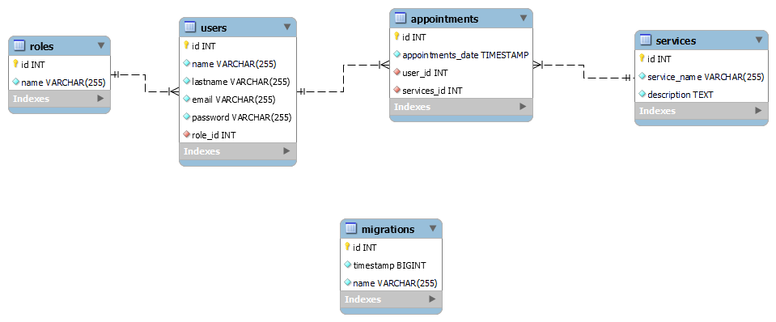

## Estado del Proyecto

El proyecto se ha completado con éxito, cumpliendo con todos los requisitos especificados en la tabla de endpoints. Además, implementaremos métodos que aportarán un valor significativo al proyecto.

El proyecto incluye funcionalidades como el registro, la validación de usuarios en el inicio de sesión y la definición de los permisos de los roles. Crearemos varios archivos, como controladores para gestionar las rutas y el sistema de autenticación, así como middleware para garantizar la seguridad del sistema, como la validación de permisos y el almacenamiento del token de acceso. Para la base de datos, se crearán las migraciones necesarias para la conexión y los modelos de entidades.

## Descripción de las tecnologías

Typescript: se utilizó para la programación.

Docker: se empleó para crear contenedores e imágenes de la base de datos.

TypeOrm: se usó para crear bases de datos y manipular los datos del sistema SQL.

Mysql: se seleccionó como el gestor de base de datos para el almacenamiento de información del proyecto.

Postman: se utilizó para probar los endpoints y enviar peticiones al sistema.

VS Code: se eligió como el editor de código para la creación del proyecto.

Para el desarrollo del proyecto, será necesario instalar las siguientes dependencias:

- npm i typescript --save-dev
- npm --init -y
- npm i express --save
- npm i @types/express @types/node -D
- npm i dotenv
- npm i typeorm --save
- npm i reflect-metadata --save
- npm i nodemon ts-node -D
- npm i mysql2 --save
- npm i bcrypt
- npm i @types/bcrypt -D
- npm i jsonwebtoken
- npm i --save-dev @types/jsonwebtoken

## Puesta en Marcha del Proyecto

Para el correcto funcionamiento del proyecto, se desarrollará varias clases, que se ilustrarán con ejemplos de código.

El siguiente código es del método `registrar`

```
import bcrypt from 'bcrypt';
import Jwt from "jsonwebtoken";
import { Request, Response } from 'express';
import { User } from '../models/User';

export const register = async (req: Request, res: Response) => {
    try {
        const name = req.body.name;
        const lastname = req.body.lastname
        const email = req.body.email;
        const password = req.body.password

        if ((password.length < 6) && (password.length > 10)) {
            return res.status(400).json({
                success: false,
                message: "La contraseña tiene que ser mayor que 7 y menor que 20"
            })
        }

        const validEmail = /^\w+([.-_+]?\w+)*@\w+([.-]?\w+)*(\.\w{2,10})+$/;
        if (!validEmail.test(email)) {
            return res.status(400).json(
                {
                    success: false,
                    message: "formato de email invalido"
                }
            )
        }

        const passwordEncrypted = bcrypt.hashSync(password, 8)

        const nuevoUser = await User.create(
            {
                name: name,
                lastname: lastname,
                email: email,
                password: passwordEncrypted,
                role: {
                    id: 1
                }
            }
        ).save();

        res.status(200).json({
            success: true,
            message: "Usuario registrado con successo"
        });
    } catch (error) {
        res.status(500).json({
            success: false,
            message: "Error al registrarse",
            error: error
        })
    }
}
```

Al desarrollar este código, se incorporaron algunas validaciones esenciales para cumplir con los requisitos mínimos de un sistema de `registro`. Estos incluyen la validación de formato de un correo electrónico y la encriptación de la contraseña.

La siguiente imagen muestra el registro de un usuario en el sistema.

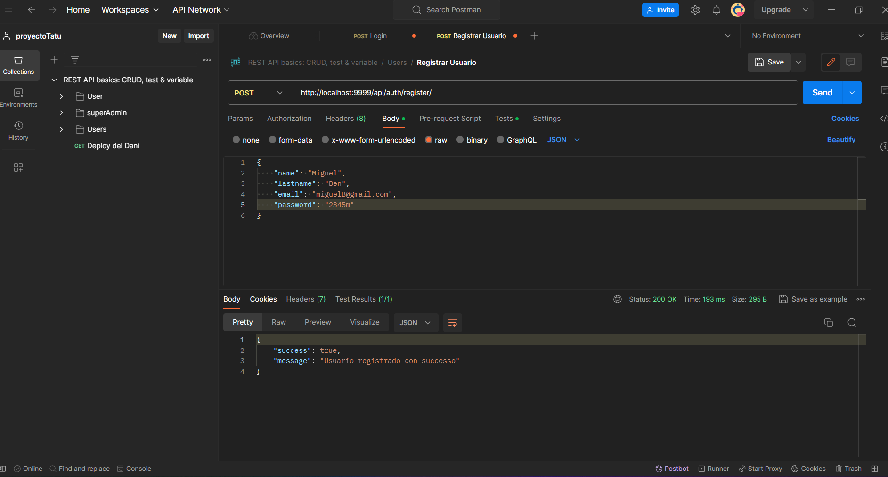

Las siguientes líneas de código explican claramente cómo se creó el método de inicio de sesión y las validaciones que se implementarán. Además, se describe la funcionalidad para la creación del token de acceso, garantizando que solo los usuarios registrados puedan acceder al sistema.

```tsx
export const login = async (req: Request, res: Response) => {
    try {
         const email = req.body.email;
         const password = req.body.password;

         if(!email || !password){
            return res.status(400).json({
                success: false,
                message: "Datos del login incorrecto"
            })
         }

         const user = await User.findOne(
            {
                where:{
                    email:email
                },
                relations:{
                    role: true
                },
                select:{
                    id:true,
                    password:password,
                    email:email
                }
            }
         )
         if(!user){
            return res.status(400).json({
                success: false,
                message: "Datos invalidos"
            })
         }
        const validarPassword = bcrypt.compareSync(password, user.password);
        if(!validarPassword){
            return res.status(400).json({
                success: false,
                message: "Password invalidos"
            })
        }

        const token = Jwt.sign(
            {
                roleId: user.id,
                roleName: user.role.name
            },
            process.env.JWT_SECRET as string,
            {
                expiresIn: "2h"
            }
        )
        
        res.status(200).json({
            success: true,
            message: "Se ha loguiado con suceso",
            token: token
        });
    } catch (error) {
        res.status(500).json({
            success: false,
            message: "Error al intentar registrarse",
            error: error
        })
    }
}
```

En las siguientes lineas se mostrarán algunos códigos de diferentes endpoints con diferentes funcionalidades ya que la dinamica no cambia mucho segun el tipo de endpoint.

La siguiente imagen se puede visualizar el logueo de un usuario.

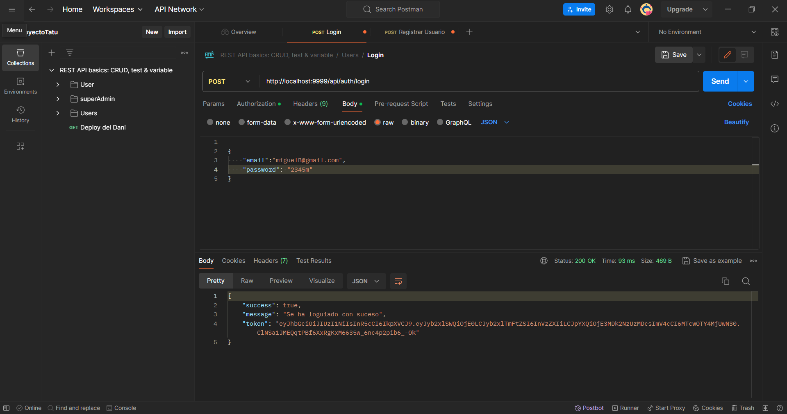

El siguiente método se define los números de elementos a mostrar en cada pagina, y el limite de elementos establecido por el usuario. El método consiste en visualizar todos los usuarios del sistema.

```tsx
const getUser = async (req: Request, res: Response) => {
    try {
        let limit = Number(req.query.limit) || 10
        const page = Number(req.query.page) || 1
        const skip = (page - 1) * limit
        const users = await User.find({
            select: {
                id: true,
                name: true,
                lastname: true,
                email: true
            },
            take: limit,
            skip: skip
        })
        res.status(200).json({
            success: true,
            message: "Lista de usuario encontrado",
            data: users
        })
    } catch (error) {
        res.status(500).json({
            success: false,
            message: "Ocurrio un error al buscar usuario",
            error: error
        })
    }
}
```

En las siguientes imagenes la primera se muestra el intento de un usuario que busca visualizar todos los usuarios del sistema, y el sistema le rechasa la petición ya que no tiene el permiso para acceder a dicha peticione, la segunda el usuario con el permiso que tiene por ser super Admin del sistema consigue visualizar todos los usuarios del sistema.

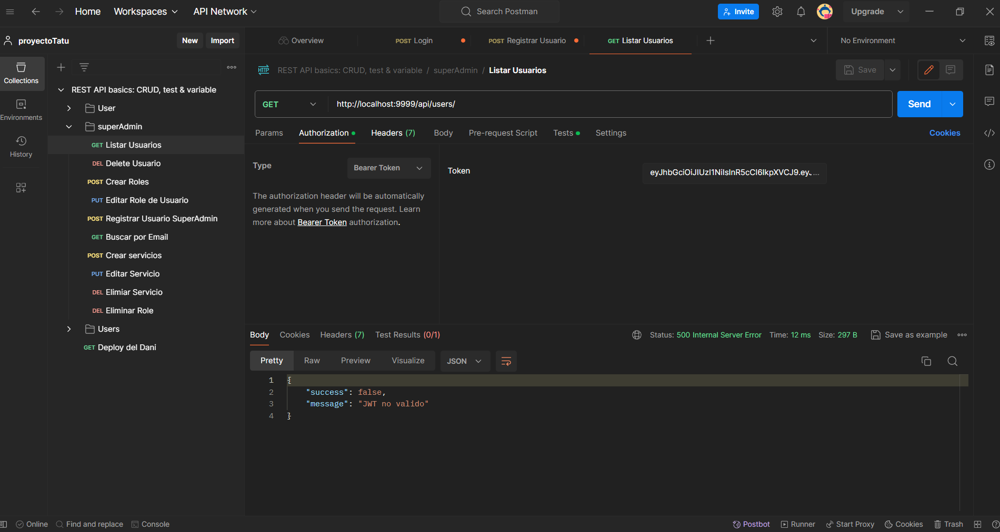

Super Admin accediendo la visualización de los usuarios.

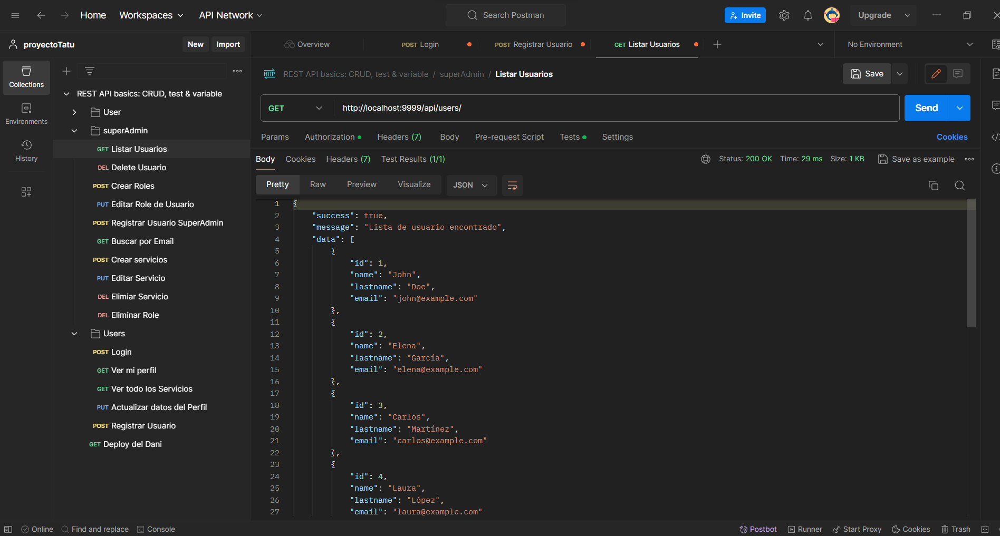

El siguiente método es para crear un tipo de role en la app, ya que los permisos se establece por roles de usuarios.

```tsx
const crearRoles = async (req: Request, res: Response) => {
    try {
        const name = req.body.name;

        if (name.length > 50) {
            return res.status(400).json({
                success: true,
                message: "El nombre es muy largo"
            })
        }

        const newRole = await Role.create({
            name: name
        }).save()

        res.status(200).json({
            success: true,
            message: "Roles Creado"
        });
    } catch (error) {
        res.status(500).json({
            success: false,
            message: "Error al crear Role",
            errro: error
        })

    }
}
```

En la imagen de abajo se puede ver la creación de un nuevo role.

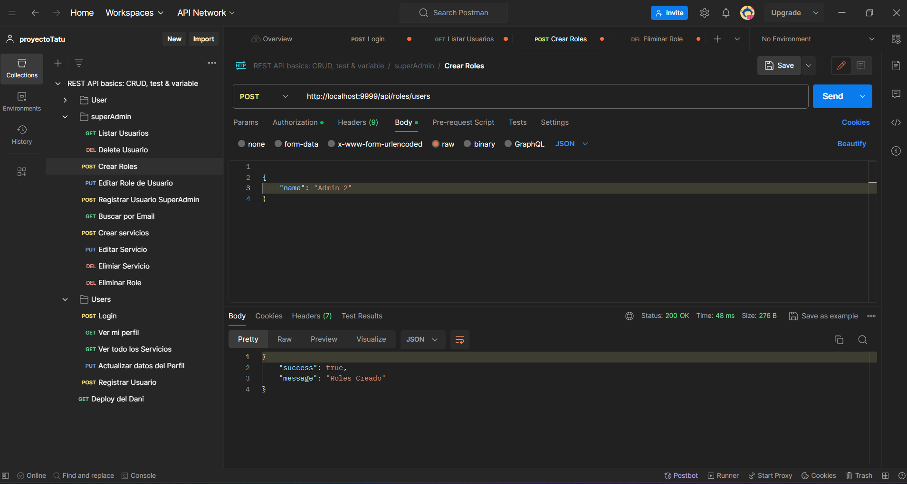

Se puede ver la creación del role en la tabla roles de la base de datos

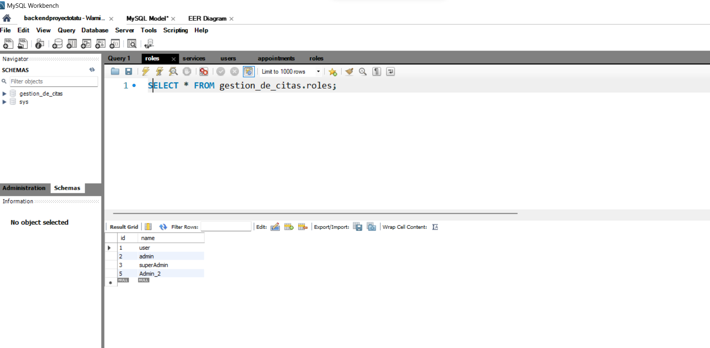

El siguiente método es de como eliminar un role el sistema. Para esto se recoge el id en una variable llama id_role, se busca el role y se comprueba que existe el tipo de role por el id, y si existe se elimina el role dentro del sistema.

```tsx
const eliminarRole = async (req: Request, res: Response) => {
    try {
        const id_role = req.params.id;

        const buscarRole = await Role.findOne(
            {
                where: {
                    id: parseInt(id_role)
                }
            }
        )

        if (!buscarRole) {
            return res.status(404).json({
                success: false,
                message: "Este role no existe"
            })
        }

        const eminar = await Role.remove(buscarRole)
        res.status(200).json({
            success: true,
            message: "Role eliminado con suceso"
        })
    } catch (error) {
        res.status(200).json({
            success: false,
            message: "Error al intentar eliminar role"
        })
    }
}
```

La siguiente imagen muestra la comprovación de eliminación de un role.

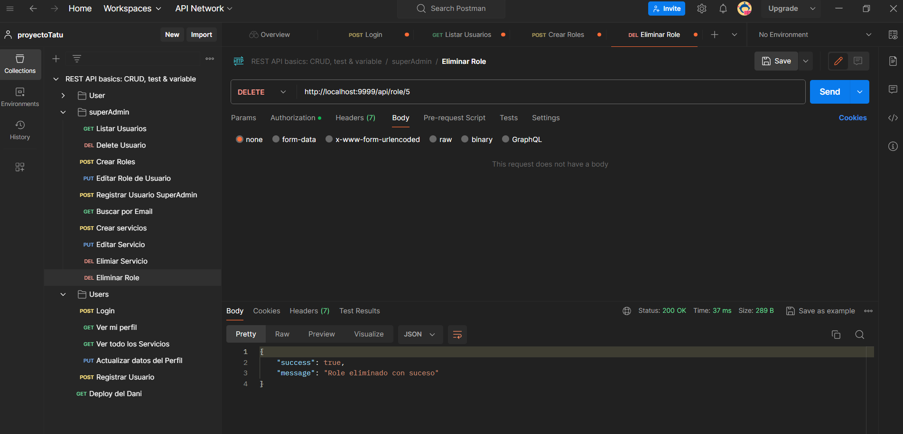

En la siguiente linea se mostra la creación del método filtrar usuario por email y nombre. Para este método se creo una interface y un objecto vacio de tipo queryFiltersI, y se comprueba su busqueda mediante método `find()`.

```tsx
const getUserByEmail = async (req: Request, res: Response) => {
    try {
        const email = req.query.email;
        const name = req.query.name;

        interface queryFiltersI {
            email?: string
            name?: string
        }

        let queryFilters: queryFiltersI = {}

        if (email) {
            queryFilters.email = email as string
        }

        if (name) {
            queryFilters.name = name as string
        }

        const users = await User.find(
            {
                where: queryFilters,
                select: {
                    id: true,
                    name: true,
                    lastname: true,
                    email: true,
                    role_id: true
                }
            }
        )

        res.status(200).json({
            success: true,
            message: "Usuario encontrado con suceso",
            data: users
        })
    } catch (error) {
        res.status(500).json({
            success: false,
            message: "Error al buscar usuario",
            error: error
        })
    }
}
```

En la siguiente imagen se puede observar la filtración de un usuario por su email.

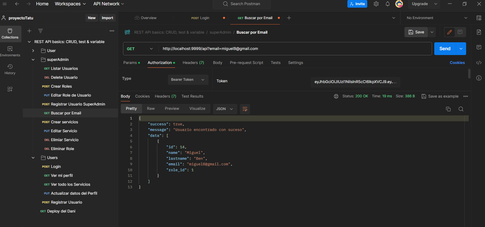

El código que se muestra es del método visualizar perfil, para poder visualizar perfil se comprueba mendiante el token de usuario, ya que solo se puede visualizar su proprio perfil.

```tsx
const myPerfil = async (req: Request, res: Response) => {
    try {
        const id_user = req.tokenData.roleId;

        const getPerfil = await User.findOne(
            {
                where: {
                    id: id_user
                },
                select: {
                    id: true,
                    name: true,
                    lastname: true,
                    email: true
                }
            }
        )

        res.status(200).json(
            {
                success: true,
                message: "Datos carregados con suceso",
                datos: getPerfil
            }
        )
    } catch (error: any) {
        res.status(500).json(
            {
                success: false,
                message: "Error al carregar los datos",
                error: error.message
            }
        )
    }
}
```

Se puede visualizar la información del usuario desde su perfil, en la siguiente imagen.

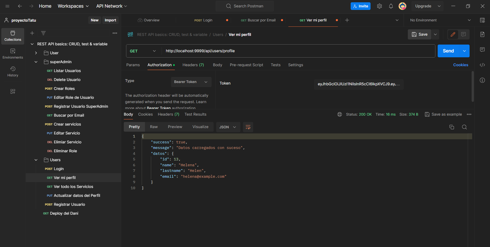

El siguiente método busca una cita pasando id de la cita como parametro, para esto también se necesita validar el usuario atraves del token de acceso, y se comprueba que solo se visualiza su cita no de otros usuarios del sistema.

```tsx
const buscarCitaPorId = async (req: Request, res: Response) => {
    try {
        const id_user = req.tokenData.roleId;
        const id_appointment = Number(req.params.id);

        const findCita = await Appointment.findOne(
            {
                where: {
                    id: id_appointment,
                    user: {
                        id:id_user
                    }
                },
                select:{
                    id: true,
                    services_id: true,
                    appointments_date: true
                }
            }
        )

        if (!findCita) {
            return res.status(404).json(
                {
                    success: false,
                    message: "No existe la cita"
                }
            )
        }
        res.status(200).json(
            {
                success: true,
                message: "Cita encontrada con suceso",
                data:findCita
            }
        )
    } catch (error) {
        res.status(500).json(
            {
                success: false,
                message: "Error al buscar la cita"
            }
        )

    }
}
```

Se puede visualizar la cita buscada por id en la siguiente imagen.

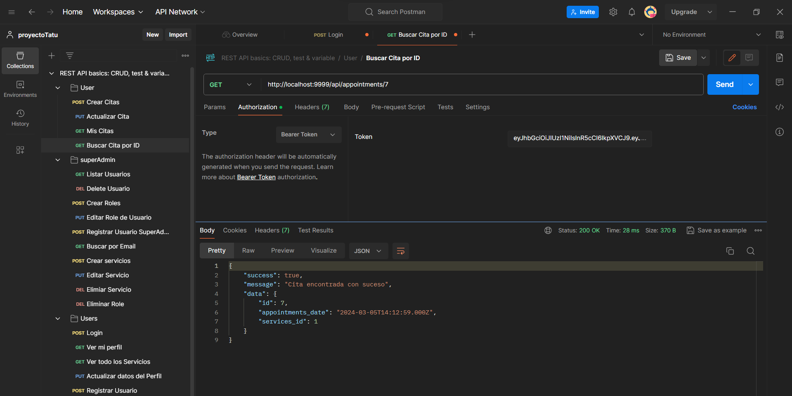

El siguiente método es de actualizar cita, que también requiere una validación por el token, para que solo el usuario logueado pueda actualizar su cita.

```tsx
const actualizarCita = async (req: Request, res: Response) => {
    try {
        const id_appointments = req.body.id;
        const user_id = req.tokenData.roleId;
        const services_id = req.body.services_id;

        const findAppointment = await Appointment.findOne(
            {
                where: {
                    id: id_appointments,
                    user: { id: user_id },
                }
            }
        )

        if (!findAppointment) {
            return res.status(404).json(
                {
                    success: false,
                    message: "Datos introducidos no coinciden con los datos de la cosulta"
                }
            )
        }

        const actualizando = await Appointment.update(
            {
                id: id_appointments,
                user: {
                    id: user_id
                },
            },
            {
                id: id_appointments,
                services_id: services_id
            }
        )
        res.status(200).json(
            {
                success: true,
                message: "Cita actualizada con suceso",
                data: actualizando
            }
        )
    } catch (error) {
        res.status(500).json({
            success: false,
            message: "Error al actualizar la cita",
            error: error
        })
    }
}
```

En la siguiente imagen se visualiza la confirmación de actualización de una cita 

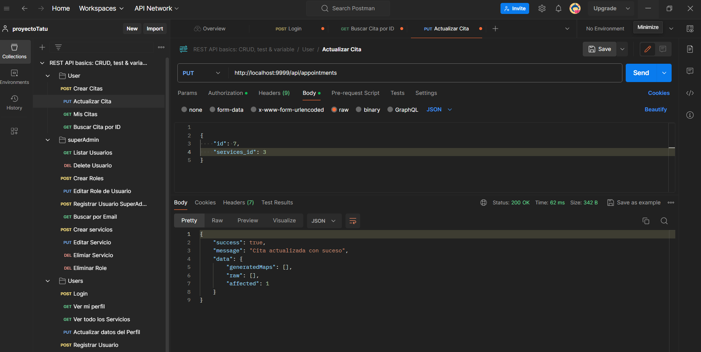

Los siguientes métodos son de los midleware.

El siguiente método comprueba si el usuario tiene un token de acceso o no pasanso en la variable token un valor de cabezera y de autorización , y luego separa las cadena del encabezado de autorización en un arreglo utilizando el espacio y recoge el segundo elemento y luego comprueba si el usuario tiene un token o uno valido, luego verifica el token con la variable secreta,  en la siguiente linea almacena el token en req.tokenData y luego llama a la siguiente función.

```tsx
import { NextFunction, Request, Response } from "express";
import Jwt from "jsonwebtoken";
import { TokenData } from "../types";

export const auth = async (req: Request, res: Response, next: NextFunction) => {
    try {
        const token = req.headers.authorization?.split(" ")[1];
        if (!token) {
            return res.status(401).json({
                success: false,
                message: "Usuario no authorizado"
            })
        }

        const decode = Jwt.verify(
            token,
            process.env.JWT_SECRET as string
        )

        req.tokenData = decode as TokenData;
        next();
    } catch (error) {
        return res.status(500).json({
            success: false,
            message: "JWT no valido"
        })
    }
}
```

Este método comprueba si el usuario es un superAdmin del sistema, para que pueda realizar ciertas tareas que solo el pueda realizar.

```tsx
import { NextFunction, Request, Response } from "express";

export const isSuperAdmin = (req: Request, res: Response, next: NextFunction) => {
    try {
        if(req.tokenData.roleName !== 'superAdmin'){
            return res.status(401).json({
                success: false,
                message: "No authorizado"
            })
        }
        next();
    } catch (error) {
        return res.status(500).json({
            success: false,
            message: "No tienes permiso"
        })
    }
}
```

En esta clase `server.ts` es donde se exportan todas las URL de cada método de diferentes clases

```tsx
import express, { Application } from 'express';
import 'dotenv/config';
import * as controllers from './controllers/controllers';
import * as userControll from './controllers/userController';
import { AppDataSource } from './database/db';
import { login, register, registerAdministradores } from './controllers/authController';
import { auth } from './middlewares/auth';
import { isSuperAdmin } from './middlewares/isSuperAdmin';
import { isUser } from './middlewares/isUser';

const app: Application = express();
const PORT = process.env.PORT || 9998;
app.use(express.json());

app.get('/api/users', auth, isSuperAdmin, controllers.getUser);
app.post('/api/roles/users',auth, controllers.crearRoles);
app.get('/api', auth, isSuperAdmin, controllers.getUserByEmail);
app.put('/api/users/:id', auth, isSuperAdmin, controllers.updateRoles);
app.delete('/api/users/:id', auth, isSuperAdmin, controllers.deleteUserById);
app.post('/api/services', auth, isSuperAdmin, controllers.crearServicio);
app.put('/api/services/:id', auth, isSuperAdmin, controllers.editarServicio);
app.delete('/api/services/:id', auth, isSuperAdmin, controllers.deleteServicio);
app.delete('/api/role/:id', auth, isSuperAdmin, controllers.eliminarRole);

app.post('/api/auth/register', register)
app.post('/api/auth/superadmin', auth, isSuperAdmin, registerAdministradores);
app.post('/api/auth/login', login);
app.get('/api/services', auth, controllers.getServices);
app.get('/api/users/profile', auth, userControll.myPerfil);

app.put('/api/users/profile/:id', auth, isUser, userControll.getupdateUser);
app.post('/api/appointments', auth, isUser, userControll.Appointments);
app.get('/api/appointments/:id', auth, isUser, userControll.buscarCitaPorId);
app.put('/api/appointments', auth, userControll.actualizarCita);
app.get('/api/appointments', auth, userControll.misCitas);

AppDataSource.initialize()
    .then(() => {
        console.log('Database connected');
    })
    .catch(error => {
        console.log(error)
    })

app.listen(PORT, () => {
    console.log(`Server running on port ${PORT}`);
});

```

La siguiente imagen muestra la estructura del proyecto con sus carpetas,


## Autor:

Miguel Bengui